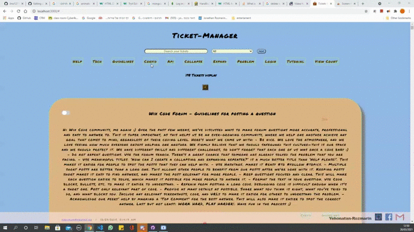

# TICKET-MANAGER

I created Ticket-Manager for management all the tickets that you need.

## Bonus

Also added some bonus:

 Can Add new ticket from client.

 Can delete ticket from client.

 Can choose how many ticket to display on page.

 Can mark ticket as done .

 Can mark ticket as undone .

 Done unDone is persistent.

 Add spinner for HTTP
request.

 Get massage saved/failed when create new ticket and mark Done/unDone ticket.

 Can watch all title's tickets that hide when hover on restore button.

 Can filter tickets by label.

 Counter that show how many tickets display on page.

link to [HEROKU](https://jino-ticket-manager.herokuapp.com/)
